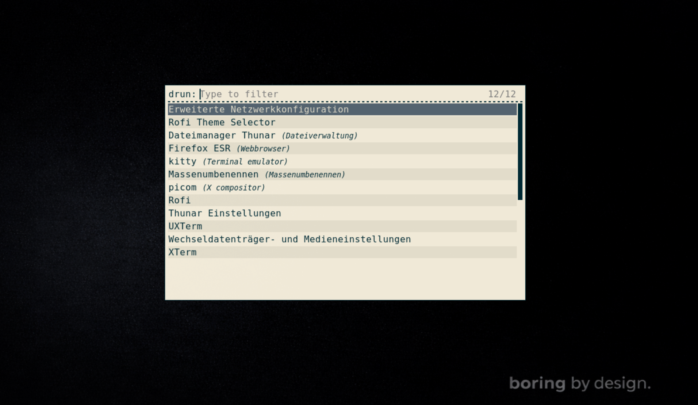

## 🪟 BoringWM


---

## 🇬🇧 English / 🇩🇪 Deutsch

**BoringWM** is a minimalist, Rust-based X11 window manager.

It is intentionally **boring by design**: predictable behavior, minimal features, no magic, no surprises.

> **BoringWM is developed on NixOS, but targets Debian Stable first.**



---

## 🎯 Project Goals

- Stability over features
- Predictable and explicit behavior
- Minimal surface area
- Long-term maintainability
- X11-first design with a possible Wayland future

BoringWM does **not** aim to be the most configurable or flashy window manager.  
It aims to be **correct**, **boring**, and **reliable**.

---

## 🧪 Development vs Target Platforms

**Development platform**
- NixOS (reproducible builds, clean Rust toolchains)

**Target / supported systems**
- Primary target: Debian Stable (currently Debian 13)
- Expected to work on Ubuntu, Linux Mint, Arch Linux and similar distributions

If it runs correctly on Debian Stable, it is expected to run correctly on most other Linux systems.

---

## 🧠 Design Philosophy

- X11 only (for now)
- No scripting language in the core
- No hidden background services
- No runtime configuration magic

Configuration and extensibility may be added later, but never at the cost of simplicity or correctness.

---

## 🪟 Features

- Master / Stack tiling layout
- Fixed, minimal gaps
- Keyboard-driven workflow
- Focused window border highlighting
- Proper WM_DELETE_WINDOW handling
- EWMH fullscreen support (games & video)
- External compositor support (picom)
- External wallpaper support (feh)

---

## ⌨ Default Keybindings

| Key | Action |
|-----|--------|
| Mod + Enter | Open terminal (kitty) |
| Mod + T | Open file manager (thunar) |
| Mod + B | Open browser (firefox) |
| Mod + D | Open File browser (rofi) |
| Mod + Q | Close window |
| Mod + J | Focus next window |
| Mod + K | Focus previous window |

---

🇬🇧 Wallpaper setup

BoringWM does not manage wallpapers itself.
Wallpaper handling is intentionally delegated to external tools to keep the window manager simple and predictable.
A common and minimal solution is feh.

An official, minimal wallpaper is included in this repository under:

assets/wallpaper/boringwm-wallpaper.png

Set the wallpaper

Copy the wallpaper to a fixed location:

cp assets/wallpaper/boringwm-wallpaper.png ~/.wallpaper


Then add the following line to your BoringWM autostart script:

feh --bg-fill "$HOME/.wallpaper" &


This approach keeps wallpaper configuration explicit, static, and boring by design.

---

## 🐧 Installation on Debian 13 (Minimal)

BoringWM is designed to run on a minimal Debian installation without a desktop environment.

```sh
# Base system
sudo apt update
sudo apt install -y xorg xinit dbus-x11 git curl

# Rust (user-local)
curl https://sh.rustup.rs -sSf | sh
source ~/.cargo/env

# Build and install BoringWM
git clone https://github.com/dennishilk/boringwm.git
cd boringwm
cargo build --release
sudo install -Dm755 target/release/boringwm /usr/local/bin/boringwm

# Recommended desktop tools
sudo apt install -y kitty picom feh

# Autostart
mkdir -p ~/.config/boringwm
cat > ~/.config/boringwm/autostart.sh << 'EOF'
#!/bin/sh
feh --bg-fill "$HOME/.wallpaper" &
picom &
EOF
chmod +x ~/.config/boringwm/autostart.sh

# Start configuration
echo "exec boringwm" > ~/.xinitrc

# Start BoringWM
startx
```

---


## 🇩🇪 
**BoringWM** ist ein minimalistischer, in Rust geschriebener X11-Window-Manager.

Er ist bewusst **boring by design**:  
vorhersehbares Verhalten, minimale Features, keine Magie, keine Überraschungen.

> **BoringWM wird auf NixOS entwickelt, zielt aber primär auf Debian Stable ab.**

---

## 🎯 Projektziele

- Stabilität statt Feature-Vielfalt
- Vorhersehbares und explizites Verhalten
- Möglichst kleine Angriffs- und Fehlerfläche
- Langfristige Wartbarkeit
- X11-first-Design mit möglicher Wayland-Perspektive

BoringWM möchte **nicht** der konfigurierbarste oder spektakulärste
Window-Manager sein.  
Er soll **korrekt**, **langweilig** und **zuverlässig** sein.

---

## 🧪 Entwicklungs- vs. Zielplattformen

**Entwicklungsplattform**
- NixOS (reproduzierbare Builds, saubere Rust-Toolchains)

**Ziel- / unterstützte Systeme**
- Primäres Ziel: Debian Stable (aktuell Debian 13)
- Erwartet lauffähig auf: Ubuntu, Linux Mint, Arch Linux und ähnlichen Distributionen

Wenn BoringWM auf Debian Stable korrekt läuft,  
sollte er auf den meisten anderen Linux-Systemen ebenfalls funktionieren.

---

## 🧠 Design-Philosophie

- X11 only (vorerst)
- Keine Skriptsprache im Core
- Keine versteckten Hintergrunddienste
- Keine Laufzeit-Konfigurationsmagie

Konfiguration und Erweiterbarkeit können später folgen,  
aber niemals auf Kosten von Einfachheit oder Korrektheit.

---

## 🪟 Features

- Master/Stack-Tiling-Layout
- Feste, minimale Gaps
- Tastatur-zentrierter Workflow
- Fokus-Hervorhebung über Fensterrahmen
- Sauberes Schließen per WM_DELETE_WINDOW
- EWMH-Fullscreen-Unterstützung (Spiele & Video)
- Externer Compositor-Support (z. B. picom)
- Externe Wallpaper-Unterstützung (z. B. feh)

---

## ⌨ Standard-Tastenkürzel

| Taste | Aktion |
|------|--------|
| Mod + Enter | Terminal öffnen (kitty) |
| Mod + T | Öffne Dateimanager (thunar) |
| Mod + B | Offne Browser (firefox) |
| Mod + D | Open Dateibrowser (rofi) |
| Mod + Q | Fenster schließen |
| Mod + J | Nächstes Fenster fokussieren |
| Mod + K | Vorheriges Fenster fokussieren |

---

🇩🇪 Wallpaper einrichten 

BoringWM verwaltet Wallpaper bewusst nicht selbst.

Die Hintergrundverwaltung wird absichtlich an externe Tools ausgelagert, um den Window-Manager einfach und vorhersehbar zu halten.
Eine gängige und minimalistische Lösung ist feh.

Ein offizielles, minimalistisches Wallpaper ist im Repository enthalten:
assets/wallpaper/boringwm-wallpaper.png

Kopiere das Wallpaper an einen festen Ort:

cp assets/wallpaper/boringwm-wallpaper.png ~/.wallpaper


Füge anschließend folgende Zeile in dein Autostart-Skript von BoringWM ein:

feh --bg-fill "$HOME/.wallpaper" &


So bleibt die Wallpaper-Konfiguration explizit, statisch und boring by design.

---

## 🐧 Installation unter Debian 13 (Minimal)
```sh
# Basissystem
sudo apt update
sudo apt install -y xorg xinit dbus-x11 git curl

# Rust (benutzerlokal)
curl https://sh.rustup.rs -sSf | sh
source ~/.cargo/env

# BoringWM bauen und installieren
git clone https://github.com/dennishilk/boringwm.git
cd boringwm
cargo build --release
sudo install -Dm755 target/release/boringwm /usr/local/bin/boringwm

# Empfohlene Tools
sudo apt install -y kitty picom feh

# Autostart
mkdir -p ~/.config/boringwm
cat > ~/.config/boringwm/autostart.sh << 'EOF'
#!/bin/sh
feh --bg-fill "$HOME/.wallpaper" &
picom &
EOF
chmod +x ~/.config/boringwm/autostart.sh

# Startkonfiguration
echo "exec boringwm" > ~/.xinitrc

# Start
startx
```


> boring is not a bug. it's a feature.
