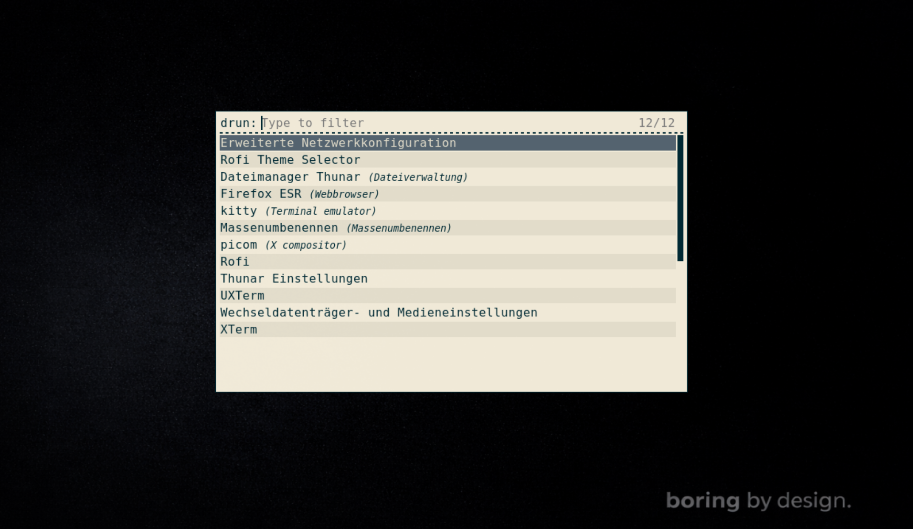

# BoringWM

  

**BoringWM** is a small, keyboard-first X11 master/stack tiling window manager: *boring by design*. It aims for explicit state, predictable ordering, and a core one person can understand. It is not a desktop environment and does not provide a panel, tray, wallpaper, compositor, notifications, lock screen, launcher, or IPC. Those jobs remain external.



## Implemented

- Deterministic master/stack layout with bounded gaps, borders, ratio, and small-screen geometry.
- Nine fixed workspaces by default, per-workspace order/focus, EWMH desktop/client/active-window properties.
- Keyboard and deliberate pointer-enter focus; root focus when a workspace is empty.
- EWMH fullscreen add/remove/toggle with saved floating state and geometry.
- Floating transient/dialog windows and manual floating toggle.
- Startup adoption, duplicate protection, lifecycle cleanup, override-redirect exclusion, configure requests, and recoverable per-client X11 errors.
- Correct `WM_DELETE_WINDOW` with `KillClient` fallback, `WM_TAKE_FOCUS`, clean exit, and process replacement restart.
- Static startup configuration and direct argument-vector spawning without a shell. Logging goes only to stderr (`RUST_LOG=boringwm=debug`).

## Known limitations

BoringWM currently treats the complete X screen as one monitor. XRandR monitor discovery, independent monitor tiling, monitor movement, hotplug, and mouse drag/resize are not implemented. Fixed-size normal hints are not yet used to infer floating state. The parser accepts the documented flat TOML subset (strings, numbers, and string arrays), not arbitrary TOML. US X keycodes are currently used. There is no state-preserving handoff: restart cleanly exposes clients, execs itself, and adopts them again. These limitations keep the candidate honest; see the [manual test plan](docs/MANUAL_TEST_PLAN.md).

## Default keys

| Key | Action |
|---|---|
| Mod+Enter / T / B / D | terminal / file manager / browser / launcher |
| Mod+Q | request client close |
| Mod+J / K | focus next / previous |
| Mod+Shift+J / K | swap with next / previous |
| Mod+M | promote focused client to master |
| Mod+H / L | decrease / increase master ratio |
| Mod+F / Space | toggle fullscreen / floating |
| Mod+1…9 | switch workspace |
| Mod+Shift+1…9 | move focused client to workspace |
| Mod+Shift+R / E | restart / exit |

Num Lock and Caps Lock do not alter bindings. Commands, gaps, borders, colors, ratio, and workspace count are configurable. Copy `config/boringwm.example.toml` to `~/.config/boringwm/config.toml`. Missing config is normal; malformed or unknown values produce a fatal diagnostic instead of guessing.

Autostart is `~/.config/boringwm/autostart.sh`. It is executed directly once (so add a shebang and executable bit). Example:

```sh
#!/bin/sh
feh --bg-fill "$HOME/.wallpaper" &
picom &
```

## Debian 13 guided installation

On a fresh Debian 13 minimal amd64 installation:

```sh
sudo apt update
sudo apt install git
git clone https://github.com/dennishilk/boringwm.git
cd boringwm
sudo ./install.sh
```

The guided installer detects an existing Debian user, reviews every change, and offers either a LightDM graphical login or console login with `startx`. Choose a complete small desktop or a coherent minimal environment. **It never creates users and never asks for or changes passwords.** See the [installer guide](docs/INSTALLER.md) for profiles, dry runs, automation, recovery, and removal.

## Manual installation

BoringWM has no official Debian package. On a minimal Debian 13 installation:

```sh
sudo apt update
sudo apt install build-essential cargo rustc rustfmt rust-clippy libxcb1-dev xorg xinit dbus-x11
cargo build --release
sudo make install PREFIX=/usr/local
mkdir -p ~/.config/boringwm
cp config/boringwm.example.toml ~/.config/boringwm/config.toml
```

For `startx`, put `exec /usr/local/bin/boringwm-session` in `~/.xinitrc`. `make install` installs the display-manager session in `/usr/share/xsessions`, plus the session wrapper, manual page, and example config. Install tools such as `kitty`, `thunar`, `firefox-esr`, `rofi`, `feh`, and `picom` separately as desired. The transparent Makefile honors `PREFIX` and `DESTDIR`.

Troubleshooting: run `DISPLAY=:0 RUST_LOG=boringwm=debug boringwm`; “another window manager” means one already owns `SubstructureRedirect`; config errors include their file and field. Key bindings currently assume a common US keycode map.

## Development

```sh
cargo fmt --all -- --check
cargo clippy --all-targets --all-features -- -D warnings
cargo test --all
cargo build --release
```

The pure layout and state/config transitions are unit tested. CI performs all commands above. Real-client validation remains in the manual checklist.

## Deutsch

BoringWM ist ein kleiner, tastaturorientierter X11-Tiling-Window-Manager mit Master/Stack-Layout — bewusst *boring by design*. Unterstützt werden Arbeitsflächen, vorhersehbarer Fokus, einfaches Floating, EWMH-Vollbild, statische Konfiguration sowie sauberer Neustart und Exit. BoringWM ist **keine Desktop-Umgebung**: Panel, Tray, Wallpaper, Compositor, Benachrichtigungen und Sperrbildschirm bleiben externe Programme. Die Installation, Tastenkürzel und bekannten Einschränkungen oben sind für beide Sprachen verbindlich; insbesondere fehlt derzeit echtes Multi-Monitor-/Hotplug- und Maus-Drag-Verhalten. Projektstatus: Beta / 1.0-Kandidat, nicht als stabil veröffentlicht.

> boring is not a bug. it's a feature.
